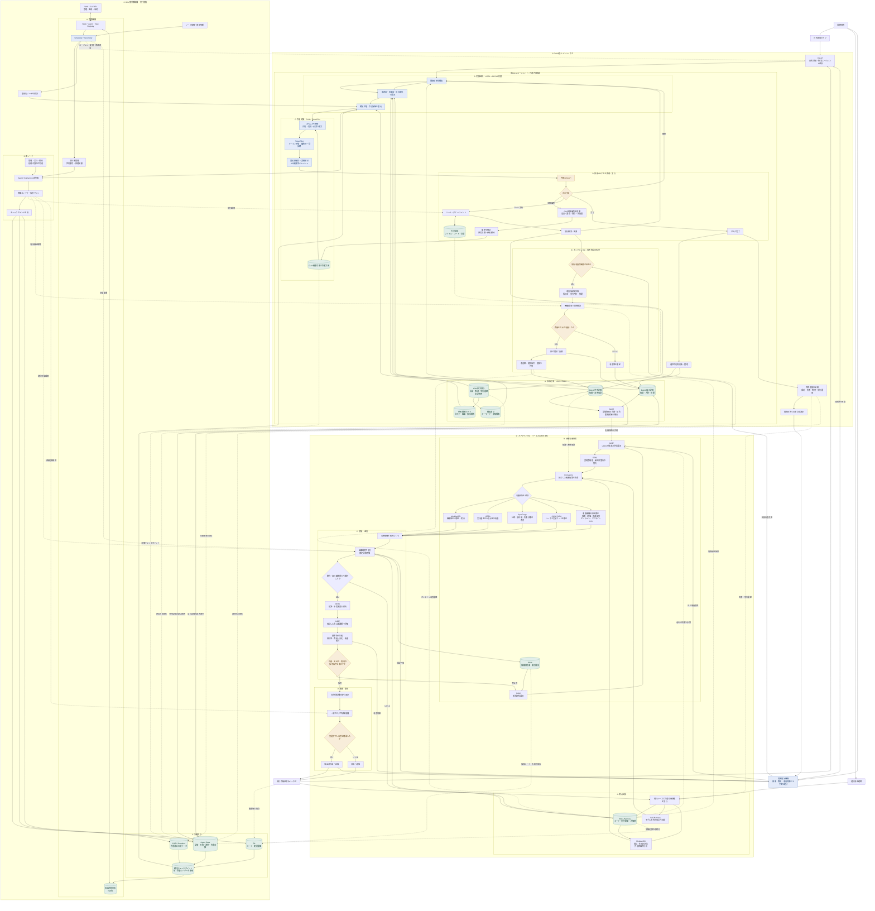

```mermaid
flowchart TD
    GOAL["最終目的"]
    H["現行の検証済みハーネス"]
    TASKS["目的達成タスク"]
    EVO_TASKS["進化用課題群"]

    ALLOC["資源配分機構<br/>成果・費用・改善効果から予算を配分"]

    GOAL --> TASKS
    GOAL --> EVO_TASKS
    GOAL --> ALLOC
    H --> DELM
    TASKS --> DELM
    ALLOC -->|"目的遂行予算"| DELM

    subgraph MAIN["① DeLM型メインハーネス"]
        direction TB

        DELM["DeLM<br/>目的分解・担当エージェント選択"]

        subgraph AGENT["各DeLMエージェント：共通内部構造"]
            direction TB

            subgraph MEMORY["A. 永続記憶：LCM + DeLM"]
                direction TB

                RAW[("LCM 原文保存<br/>会話・観測・実行履歴<br/>追記専用")]
                SHARED[("DeLM 共有記憶<br/>知識・改善仮説")]
                SELF[("DeLM 自己記憶<br/>経験・方針・技能")]
                INDEX[("検索索引<br/>キーワード・意味検索")]
                GRAPH[("参照関係グラフ<br/>タスク・因果・依存関係")]
                DOMAIN["DeLM<br/>記憶管轄の分割・統合<br/>重複知識の検出"]

                RAW --> INDEX
                RAW --> GRAPH
                SHARED <--> DOMAIN
                SELF <--> DOMAIN
            end

            subgraph RETRIEVAL["B. 文脈選択：VISTA + RECAP代替"]
                SEARCH["関連情報を検索"]
                RANK["関連度・重要度・依存関係で選択"]
                RESTORE["必要な原文を復元"]

                SEARCH --> RANK --> RESTORE
            end

            subgraph CONTEXT["C. 作業文脈：CLM + TokenPilot"]
                WORK[("CLM 編集可能な作業文脈")]
                BUILD["API入力を構築<br/>目的・記憶・必要な原文"]
                GUARD["TokenPilot<br/>トークン予算・編集の一括反映"]
                PREFIX["固定接頭辞 + 変動部分<br/>API接頭辞キャッシュ"]

                WORK --> BUILD
                BUILD --> GUARD --> PREFIX
            end

            subgraph EXEC["D. 外部APIによる推論・実行"]
                API["外部LLM API"]
                DECIDE{"次の行動"}

                PATCH["CLM文脈編集を提案<br/>追加・置換・削除・再配置"]
                VALID["編集を検証<br/>原文保護・参照維持"]

                TOOL["ツール・子エージェント"]
                SPACE[("作業領域<br/>ファイル・コード・実験")]
                OBS["実行結果・観測"]
                DONE["タスク完了"]

                API --> DECIDE
                DECIDE -->|"文脈編集"| PATCH
                PATCH --> VALID
                DECIDE -->|"ツール実行"| TOOL
                TOOL <--> SPACE
                TOOL --> OBS
                DECIDE -->|"完了"| DONE
            end

            subgraph ONLINE["E. オンラインRSI：局所的自己改善"]
                DETECT{"局所改善の価値があるか"}
                HYP["改善仮説を生成<br/>指示文・実行方針・技能"]
                LOCALTEST["隔離環境で局所検証"]
                LOCALGATE{"費用を含めて改善したか"}
                APPLY["自己方針に反映"]
                SHARE["改善案・適用条件・根拠を共有"]
                REJECT["改善案を棄却"]

                DETECT -->|"はい"| HYP
                HYP --> LOCALTEST --> LOCALGATE
                LOCALGATE -->|"はい"| APPLY
                LOCALGATE -->|"いいえ"| REJECT
                APPLY --> SHARE
            end

            UPDATE["通常の記憶更新・整理"]

            SEARCH --> RANK
            INDEX --> SEARCH
            GRAPH --> RANK
            SHARED --> RANK
            SELF --> RANK
            RAW --> RESTORE
            RESTORE --> BUILD

            PREFIX --> API
            VALID --> WORK

            OBS --> RAW
            OBS --> SEARCH
            OBS --> DETECT

            DECIDE -->|"継続"| SEARCH

            DONE --> UPDATE
            UPDATE --> SELF
            UPDATE --> SHARED

            APPLY --> SELF
            SHARE --> SHARED
            REJECT --> SELF
        end

        OUTCOME["目的達成の結果<br/>成功・失敗・費用・実行履歴"]
        METRIC["最終目的への寄与を測定"]

        DELM --> SEARCH
        DONE --> OUTCOME
        OUTCOME --> METRIC
    end

    METRIC --> ALLOC
    OUTCOME -.->|"失敗・実行履歴"| RUN
    ALLOC -->|"局所改善予算"| DETECT

    subgraph RSI["② オフラインRSI：ハーネス全体の進化"]
        direction TB

        subgraph OBSERVATION["A. 弱点発見"]
            RUN["現行ハーネスで進化用課題を実行"]
            LOG[("Meta-Harness<br/>コード・実行履歴・評価値")]
            WEAK["Self-Harness<br/>モデル固有の弱点を抽出"]
            CONTRAST["ModularRSI<br/>成功・失敗の対比<br/>共通原因の分析"]

            RUN --> LOG
            RUN --> WEAK
            RUN --> CONTRAST
            LOG --> CONTRAST
        end

        subgraph EXPLORATION["B. 分散改善探索"]
            ARCH[("DGM<br/>候補系統樹・親子関係")]
            PARENT["DGM<br/>親候補を選択"]
            POLICY["AIDE²<br/>UCB1で探索方針を選択"]
            REG["RRSI<br/>変更数制限・未探索箇所の優先"]
            INNOV["Innovators<br/>独立した改善仮説を生成"]
            TARGET{"改善対象を選択"}

            MOD["ModularRSI<br/>機能単位の修正・統合"]
            PROMPT["GEPA<br/>実行履歴から指示文を改善"]
            SPEC["SpecForge<br/>仕様・依存順・失敗分散の改善"]
            CODE["SICA / DGM<br/>ハーネス実装コードを修正"]
            META["改善機構自体を修正<br/>探索・評価・資源配分<br/>オンライン・オフラインRSI"]

            ARCH --> PARENT
            PARENT --> POLICY
            POLICY --> REG
            REG --> INNOV
            INNOV --> TARGET

            TARGET --> MOD
            TARGET --> PROMPT
            TARGET --> SPEC
            TARGET --> CODE
            TARGET --> META
        end

        subgraph TEST["C. 実験・選別"]
            MERGE["改善候補を組み立てる"]
            TESTRUN["隔離環境で実行<br/>固定計算予算"]
            VALID_RSI{"動作・自己編集能力を維持したか"}
            FILTER["RRSI<br/>批評・不要変更の除去"]
            HIDDEN["AIDE²<br/>独立した非公開課題で評価"]
            COMPARE["基準版と比較<br/>成功率・費用・汎化・改善能力"]
            GATE{"性能・安全性・費用の<br/>採用条件を満たすか"}

            MERGE --> TESTRUN --> VALID_RSI
            VALID_RSI -->|"はい"| FILTER
            FILTER --> HIDDEN --> COMPARE --> GATE
        end

        subgraph RELEASE["D. 配備・復旧"]
            CANDIDATE["次世代候補の版を固定"]
            CANARY["一部タスクで試験配備"]
            RELEASE_GATE{"実運用でも改善を確認したか"}
            PROMOTE["検証済み版へ昇格"]
            ROLLBACK["旧版へ復帰"]

            CANDIDATE --> CANARY
            CANARY --> RELEASE_GATE
            RELEASE_GATE -->|"はい"| PROMOTE
            RELEASE_GATE -->|"いいえ"| ROLLBACK
        end

        WEAK --> INNOV
        CONTRAST --> INNOV
        LOG -.->|"過去の失敗を参照"| POLICY

        MOD --> MERGE
        PROMPT --> MERGE
        SPEC --> MERGE
        CODE --> MERGE
        META --> MERGE

        TESTRUN --> LOG
        TESTRUN --> ARCH
        VALID_RSI -->|"いいえ"| LOG
        GATE -->|"不採用"| PARENT
        GATE -->|"採用"| CANDIDATE
    end

    H --> RUN
    EVO_TASKS --> RUN

    ALLOC -->|"自己改善予算"| POLICY
    ALLOC -->|"検証予算"| TESTRUN

    SHARED -.->|"知識・改善仮説"| INNOV
    SHARE -.->|"オンライン改善履歴"| LOG
    LOCALTEST -.->|"局所検証結果"| LOG
    DOMAIN -.->|"重複探索の抑制"| POLICY

    COMPARE -->|"改善効果"| ALLOC
    PROMOTE --> H
    PROMOTE --> ALLOC
    ROLLBACK --> H

    subgraph INFRA["③ Oriel型分散配備・実行基盤"]
        direction TB

        UI["Web / CLI / API<br/>管理・監視・承認"]

        subgraph CONTROL["A. 管理機構"]
            REGISTRY["Node・Agent・Task Registry"]
            SCHED["Scheduler / Reconciler"]
            LEASE["実行権管理<br/>世代番号・排他制御"]
            CSTATE[("複製管理状態<br/>Raft等")]

            REGISTRY --> SCHED --> LEASE
            REGISTRY <--> CSTATE
        end

        subgraph NODE["B. 各ノード"]
            ROLES["管理・実行・保存<br/>役割の兼任が可能"]
            RUNNER["Agent / hypharness実行器"]
            SANDBOX["隔離コンテナ・仮想マシン"]
            SNAPSHOT["チェックポイント生成"]

            ROLES --> RUNNER --> SANDBOX
            SANDBOX --> SNAPSHOT
        end

        subgraph STORAGE["C. 分散保存"]
            GIT[("Git<br/>コード・変更履歴")]
            CAS[("CAS / Snapshot<br/>作業領域の実データ")]
            STATE[("Agent State<br/>記憶・目的・進捗・作業文脈")]
            MANIFEST[("確定チェックポイント<br/>版・状態ID・データ参照")]

            GIT --> MANIFEST
            CAS --> MANIFEST
            STATE --> MANIFEST
        end

        FAILURE["ノード故障・接続切断"]
        RECOVER["復旧先ノードを選択"]
        RESTORE["確定状態・作業領域を復元"]

        UI <--> REGISTRY
        LEASE --> RUNNER

        SNAPSHOT --> GIT
        SNAPSHOT --> CAS
        SNAPSHOT --> STATE

        MANIFEST --> CSTATE

        FAILURE --> SCHED
        SCHED --> RECOVER
        RECOVER --> RESTORE
        MANIFEST --> RESTORE
        RESTORE --> RUNNER
    end

    SCHED -.->|"エージェント配置・資源割当"| DELM
    SCHED -.->|"実験配置"| TESTRUN

    SANDBOX -.->|"実行環境"| TOOL
    SANDBOX -.->|"局所検証環境"| LOCALTEST
    SANDBOX -.->|"進化実験環境"| TESTRUN
    SANDBOX -.->|"試験配備環境"| CANARY

    RAW -.->|"原文の永続化"| STATE
    SHARED <-->|"共有記憶の読み書き"| STATE
    SELF <-->|"自己記憶の読み書き"| STATE
    WORK -.->|"文脈チェックポイント"| STATE
    OUTCOME -.->|"進捗の永続化"| STATE
    LOG -.->|"実験記録の永続化"| STATE

    SPACE -.->|"作業領域の保存"| CAS
    ARCH -.->|"候補コード・系統の保存"| GIT
    H -.->|"配備版の保存"| GIT

    classDef storage fill:#e2eee9,stroke:#40866b,color:#123b2c
    classDef compute fill:#e4ebfa,stroke:#567db8,color:#193965
    classDef active fill:#f8edda,stroke:#bd8a3c,color:#593b10

    class RAW,SHARED,SELF,INDEX,GRAPH,WORK,SPACE,LOG,ARCH,GIT,CAS,STATE,MANIFEST,CSTATE storage
    class SEARCH,RANK,RESTORE,BUILD,GUARD,PREFIX,ALLOC,SCHED compute
    class API,DECIDE,DETECT,LOCALGATE,GATE,RELEASE_GATE active
```
